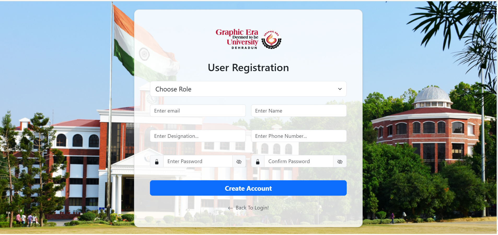
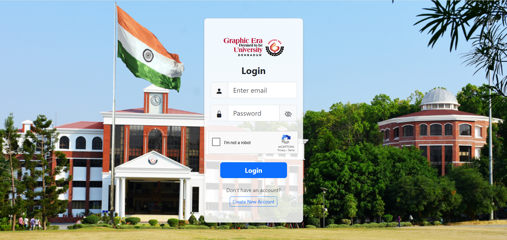
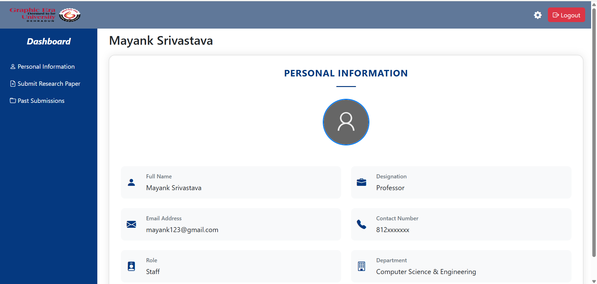
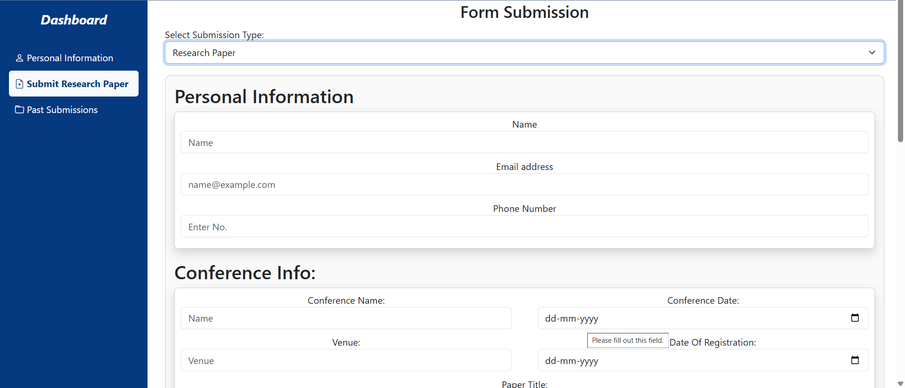
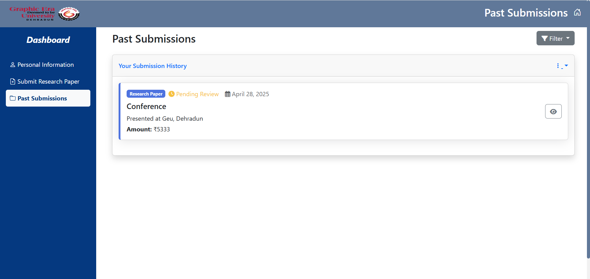

# GEU Research Submission Portal

## 📌 Project Overview
A secure web portal for academic staff to submit research papers/journals, track grants, and manage submissions. Built with **Node.js**, **Express**, and **Bootstrap**.







## 🚀 Key Features
- **Role-Based Access** (Staff/Dean/Accountant)
- **Dual Submission System** (Research/Journal)
- **Annual Grant Limits** (₹20k Research/₹30k Journal)
- **PDF Validation** (10MB max, MIME type check)
- **Dynamic Co-Author Management**
- **Submission History Tracking**
- **Secure Session Management**

## 📂 Project Structure
/research-portal
├── public
│ ├── submitResearch.htm # Main submission form
│ ├── past-submissions.html # Submission history
│ ├── staff-dashboard.html # User dashboard
│ ├── login.html # Login page
│ ├── register.htm # Registration page
│ └── assets/ # CSS/JS/Images
├── uploads
│ ├── submissions/ # Research PDF storage
│ └── profile-pictures/ # User avatars
├── models
│ ├── users.json # User database
│ └── submissions.json # Submission records
├── server.js # Backend server
├── package.json # Dependencies
├── .env # Config file
└── README.md # This documentation


## 🛠️ Setup Instructions

### 1️⃣ Install Dependencies
Ensure **Node.js** is installed, then run:
```sh
npm install express body-parser bcrypt pdfkit multer axios dotenv
```

### 2️⃣ Start the Server
```sh
node server.js
```
The server runs on **http://localhost:4000/**

### 3️⃣ Open the App
- Open `http://localhost:4000/register.html` to register a user.
- Open `http://localhost:4000/login.html` to log in.
- If login is successful, you'll be redirected to `staff-dashboard.html`.

## 📜 API Endpoints
| Method | Endpoint      | Description |
|--------|-------------|-------------|
| POST   | /register   | Registers a new user |
| POST   | /login      | Authenticates a user |
| GET    | /dashboard  | Fetches user details |

## 🔒 Security Features
-**reCAPTCHA v3 integration**

-**Password hashing with bcrypt**

-**Session cookie protection**

-**File type validation**

-**Input sanitization**

## 📅 Future Roadmap
-**MongoDB integration**

-**Admin approval workflow**

-**Email notifications**

-**Multi-file upload support**

-**PDF content analysis**


## 👨‍💻 Author
[Mayank] - Developed as part of a learning project.

---
### 🎯 If you found this useful, don't forget to ⭐ the repo!

